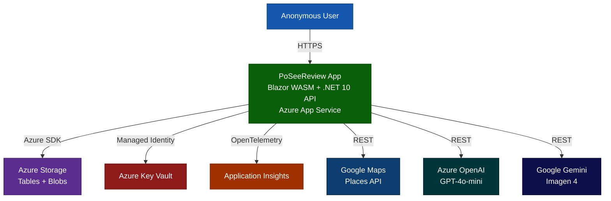

# SeeReview

**Turning Real Reviews into Surreal Stories** — transforms real restaurant reviews into AI-generated four-panel comic strips. No account required.

## What is SeeReview?

SeeReview detects your location, finds the 10 nearest restaurants via Google Maps, pulls their strangest reviews, and feeds them to AI. Azure OpenAI GPT-4o-mini scores each review's "strangeness" (0–100) and writes a narrative. Google Gemini Imagen 4 renders that narrative as a four-panel comic strip PNG stored in Azure Blob Storage. The weirdest restaurants surface in a global Hall of Fame leaderboard ranked by strangeness score.

## Architecture



**Frontend**: Blazor WebAssembly (same origin as API — no separate host)  
**Backend**: ASP.NET Core 10 Web API — rate-limited, bot-filtered, Key Vault-backed  
**Storage**: Azure Table Storage (comics, restaurants, leaderboard) + Blob Storage (comic PNGs)  
**AI**: Azure OpenAI GPT-4o-mini (narrative + score) + Google Gemini Imagen 4 (comic PNG)  
**Data Source**: Google Maps Places API for nearby restaurants and reviews

## Quick Start

### Prerequisites

- [.NET 10.0 SDK](https://dotnet.microsoft.com/download/dotnet/10.0) (version pinned in `global.json`)
- [Docker Desktop](https://www.docker.com/products/docker-desktop/) — for Azurite local storage
- [Node.js LTS](https://nodejs.org/) — for Playwright E2E tests
- Google Maps API Key, Azure OpenAI resource, Google Gemini API Key

### Running the Application

#### 1. Clone and Navigate

```powershell
git clone <repository-url>
cd PoSeeReview
```

#### 2. Start Azurite (Local Storage Emulator)

```powershell
docker compose up azurite -d
```

#### 3. Configure User Secrets

```powershell
cd src/Po.SeeReview.Api

dotnet user-secrets set "AzureStorage:ConnectionString"    "UseDevelopmentStorage=true"
dotnet user-secrets set "GoogleMaps:ApiKey"                "YOUR_GOOGLE_MAPS_KEY"
dotnet user-secrets set "AzureOpenAI:Endpoint"             "https://YOUR_RESOURCE.openai.azure.com/"
dotnet user-secrets set "AzureOpenAI:ApiKey"               "YOUR_AZURE_OPENAI_KEY"
dotnet user-secrets set "AzureOpenAI:DeploymentName"       "gpt-4o-mini"
dotnet user-secrets set "Google:GeminiApiKey"              "YOUR_GEMINI_KEY"
dotnet user-secrets set "ApplicationInsights:ConnectionString" "YOUR_APP_INSIGHTS_CS"  # optional

cd ../..
```

#### 4. Run the Application

```powershell
dotnet run --project src/Po.SeeReview.Api --launch-profile https
```

The application starts at `https://localhost:5001` (API + Blazor WASM on the same origin).
Diagnostics: `https://localhost:5001/diag` (Development mode only).

Open your browser to the URL displayed in the console.

#### 5. Verify Application Health

Navigate to `/diag` to see the health status of all application dependencies (Azure Table, Blob, Google Maps).

#### 6. Request Requirements & Limits

- Attach a browser-style `User-Agent` header when exercising APIs (non-browser clients without one receive `400`).
- Rate limiting allows 60 requests per minute per client IP; exceeding the limit returns `429` with `Retry-After: 60` seconds.
- Health check and takedown endpoints are subject to the same safeguards.

### Development Workflow

```powershell
# Restore all packages
dotnet restore

# Build entire solution
dotnet build

# Run all tests (locally only)
dotnet test

# Format code
dotnet format

# Run E2E tests (Playwright)
cd tests/e2e
npm install
npx playwright test
```

## Azure Deployment

Deploy to Azure using **Azure Developer CLI (azd)**:

```powershell
azd auth login
azd up        # provision + deploy (first time)
azd deploy    # code-only redeploy
azd monitor --logs
azd down      # remove all resources
```

See [docs/DevOps.md](./docs/DevOps.md) for the full CI/CD pipeline, Key Vault secrets reference, and security checklist.


## Project Structure

```
src/
├── Po.SeeReview.Api/            # ASP.NET Core 10 Web API + Blazor WASM host
│   ├── Controllers/             # REST endpoints (restaurants, comics, leaderboard, takedowns)
│   ├── Middleware/              # UserAgent filtering, ProblemDetails, request logging
│   ├── HostedServices/          # ExpiredComicCleanupService (runs every 30 min)
│   └── Program.cs               # DI, rate limiting, CORS, Key Vault, Serilog
│
├── Po.SeeReview.Client/         # Blazor WebAssembly frontend
│   ├── Pages/                   # Index, ComicView, Leaderboard, Diagnostics
│   ├── Components/              # RestaurantCard, ComicStrip, LoadingIndicator
│   └── Services/                # ApiClient, GeolocationService, ShareService
│
├── Po.SeeReview.Core/           # Domain entities and interfaces (no external deps)
├── Po.SeeReview.Infrastructure/ # Azure Storage, Google Maps, OpenAI, Gemini integrations
└── Po.SeeReview.Shared/         # Shared DTOs between Client and API

tests/
├── Po.SeeReview.UnitTests/      # XUnit + Moq
├── Po.SeeReview.IntegrationTests/ # WebApplicationFactory
└── e2e/                         # Playwright (TypeScript)
```

## Documentation

| File | Description |
|---|---|
| [docs/Architecture.mmd](./docs/Architecture.mmd) | C4 Level 1 system context — Azure deployment topology |
| [docs/Architecture_SIMPLE.mmd](./docs/Architecture_SIMPLE.mmd) | Simplified architecture overview |
| [docs/SystemFlow.mmd](./docs/SystemFlow.mmd) | Full user journey + comic generation pipeline sequence diagram |
| [docs/SystemFlow_SIMPLE.mmd](./docs/SystemFlow_SIMPLE.mmd) | Simplified user flow |
| [docs/DataModel.mmd](./docs/DataModel.mmd) | Entity relationship diagram — all entities and relations |
| [docs/DataModel_SIMPLE.mmd](./docs/DataModel_SIMPLE.mmd) | Simplified ER diagram |
| [docs/ProductSpec.md](./docs/ProductSpec.md) | PRD, business rules, success metrics, acceptance criteria |
| [docs/DevOps.md](./docs/DevOps.md) | CI/CD, onboarding, Key Vault secrets, security checklist, blast radius assessment |
| [infra/README.md](./infra/README.md) | Azure Bicep infrastructure modules |

