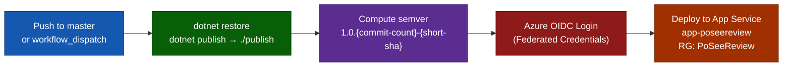

# DevOps — PoSeeReview

> Unified deployment, onboarding, CI/CD, and secrets reference.

---

## Blast Radius Assessment

*This section describes the impact of the docs consolidation refactor and any future structural changes.*

| Change | Blast Radius | Downstream Impact |
|---|---|---|
| **Docs folder deleted and rebuilt** | Docs only | No runtime code changed. Any external links to old `docs/PRD.MD`, `docs/deployment.md`, `docs/DEPLOYMENT_SETUP.md`, etc. will 404. Update `README.md` links (done). |
| **Switch image gen: DALL-E 3 → Gemini Imagen 4** | `GeminiComicService`, `appsettings`, Key Vault secrets | Old `AzureOpenAI:DalleDeploymentName` secret no longer needed. `GeminiApiKey` must be present in Key Vault. |
| **Azure OpenAI → text-only** | `AzureOpenAIService` | Now handles strangeness scoring and narrative only. Image generation fully decoupled. |
| **Table Storage TTL change** | `Comic`, `Restaurant`, `Leaderboard` entities | All cached data expires on new TTL; existing rows with old TTL remain until cleanup service cycles. |
| **Rate limit adjustment** | `RateLimiting` config section | Changes take effect on next app restart; no migration required. |
| **New leaderboard region** | `LeaderboardService`, Blazor `Leaderboard.razor` | Requires Blazor dropdown update and new PartitionKey entries in `PoSeeReviewLeaderboard` table. |

---

## Day 1 — Local Dev Setup

### Prerequisites

| Tool | Version | Purpose |
|---|---|---|
| .NET SDK | 10.0.x (pinned via `global.json`) | Build and run API + Blazor WASM |
| Docker Desktop | Latest | Run Azurite storage emulator |
| Node.js | LTS | E2E Playwright tests |
| Google Maps API Key | — | Restaurant search and reviews |
| Azure OpenAI resource | GPT-4o-mini deployment | Review analysis |
| Google Gemini API Key | Imagen 4 access | Comic PNG generation |

### Step 1 — Start Azure Storage Emulator

```powershell
docker compose up azurite -d
```

Azurite exposes:
- **Blob**: `http://127.0.0.1:10000`
- **Queue**: `http://127.0.0.1:10001`
- **Table**: `http://127.0.0.1:10002`

Data is persisted to a named Docker volume (`azurite-data`). Stop with `docker compose down`.

### Step 2 — Configure Secrets (User Secrets, never committed)

```powershell
cd src/Po.SeeReview.Api

dotnet user-secrets set "AzureStorage:ConnectionString"    "UseDevelopmentStorage=true"
dotnet user-secrets set "GoogleMaps:ApiKey"                "YOUR_GOOGLE_MAPS_KEY"
dotnet user-secrets set "AzureOpenAI:Endpoint"             "https://YOUR_RESOURCE.openai.azure.com/"
dotnet user-secrets set "AzureOpenAI:ApiKey"               "YOUR_AZURE_OPENAI_KEY"
dotnet user-secrets set "AzureOpenAI:DeploymentName"       "gpt-4o-mini"
dotnet user-secrets set "Google:GeminiApiKey"              "YOUR_GEMINI_API_KEY"
dotnet user-secrets set "ApplicationInsights:ConnectionString" "YOUR_APP_INSIGHTS_CS"  # optional locally

cd ../..
```

### Step 3 — Run the Application

```powershell
dotnet run --project src/Po.SeeReview.Api --launch-profile https
```

| Endpoint | URL |
|---|---|
| App + API | `https://localhost:5001` |
| Health check | `https://localhost:5001/api/health` |
| Diagnostics | `https://localhost:5001/diag` (Development only) |

### Step 4 — Verify

Navigate to `/diag` in the browser. All three health checks (Azure Table, Blob, Google Maps) should report **Healthy**.

---

## Developer Workflow

```powershell
dotnet restore          # Restore NuGet packages
dotnet build            # Build entire solution
dotnet test             # Run unit + integration tests
dotnet format           # Fix code style

# E2E tests (Playwright)
cd tests/e2e
npm install
npx playwright test
```

---

## CI/CD Pipeline

**File**: `.github/workflows/azure-deploy.yml`



### Required GitHub Secrets

| Secret | Description |
|---|---|
| `AZURE_CLIENT_ID` | Service principal / Managed Identity client ID (OIDC) |
| `AZURE_TENANT_ID` | Azure AD tenant ID |
| `AZURE_SUBSCRIPTION_ID` | Azure subscription ID |

No API keys are stored in GitHub — all runtime secrets live in Key Vault.

> **Note**: Tests are not run in CI. Run `dotnet test` locally or add a test step before the publish step.

---

## Azure Provisioning (azd)

```powershell
# First-time provision + deploy
azd auth login
azd up

# Code-only redeploy after provisioning
azd deploy

# Stream live logs
azd monitor --logs

# Tear down all resources
azd down
```

`azd up` provisions (via `infra/main.bicep`):

| Resource | Purpose |
|---|---|
| Log Analytics Workspace | App Insights backend |
| Application Insights | Telemetry and tracing |
| Azure Storage Account | Table + Blob storage for all app data |
| Azure Key Vault `kv-poshared` | All runtime secrets |
| Key Vault Access Policy | Managed Identity for the Container App |
| Azure Container Apps Environment | App hosting runtime |
| Container App | Combined API + Blazor WASM host |
| Budget Alert | Cost guardrail |

---

## Key Vault Secrets Reference

All secrets are stored in Key Vault `kv-poshared`. The API loads them at startup using a two-pass strategy: shared secrets first, then `PoSeeReview--` prefixed app-specific overrides.

| Key Vault Secret Name | Maps To Config Path | Description |
|---|---|---|
| `AzureOpenAI--Endpoint` | `AzureOpenAI:Endpoint` | Azure AI Foundry endpoint URL |
| `AzureOpenAI--ApiKey` | `AzureOpenAI:ApiKey` | Azure OpenAI API key |
| `AzureOpenAI--DeploymentName` | `AzureOpenAI:DeploymentName` | GPT deployment name (`gpt-4o-mini`) |
| `ConnectionStrings--AzureTableStorage` | `ConnectionStrings:AzureTableStorage` | Table Storage connection string |
| `ConnectionStrings--AzureBlobStorage` | `ConnectionStrings:AzureBlobStorage` | Blob Storage connection string |
| `PoSeeReview--Google--GeminiApiKey` | `Google:GeminiApiKey` | Google Gemini Imagen 4 API key |
| `PoSeeReview--GoogleMaps--ApiKey` | `GoogleMaps:ApiKey` | Google Maps Places API key |
| `PoSeeReview--ApplicationInsights--ConnectionString` | `ApplicationInsights:ConnectionString` | App Insights connection string |

---

## Environment Configuration

### appsettings.json Key Sections

```json
{
  "KeyVault": { "Endpoint": "https://kv-poshared.vault.azure.net/" },
  "AzureStorage": {
    "ComicsTableName":       "PoSeeReviewComics",
    "ComicsContainerName":   "comics",
    "RestaurantsTableName":  "PoSeeReviewRestaurants",
    "LeaderboardTableName":  "PoSeeReviewLeaderboard"
  },
  "Comics": {
    "MinimumReviewsRequired":    5,
    "MaximumReviewsForAnalysis": 5,
    "CacheDurationDays":         7,
    "MinimumStrangenessScore":   20
  },
  "RateLimiting": {
    "GlobalPermitLimit": 60,
    "ComicsPostPermitLimit": 3
  },
  "Cleanup": {
    "ExpiredComicIntervalMinutes": 30,
    "ExpiredComicBatchSize": 25
  }
}
```

### Environment-Specific Overrides

| Variable | Dev Value | Prod Value |
|---|---|---|
| `ASPNETCORE_ENVIRONMENT` | `Development` | `Production` |
| `DISABLE_USER_AGENT_VALIDATION` | `true` (for tests) | *(unset)* |
| `AzureStorage:ConnectionString` | `UseDevelopmentStorage=true` | Via Key Vault |
| CORS allowed origins | `localhost:5000/5001/5245/7175` | `https://posee-review.azurecontainerapps.io` |

---

## Observability

**Logs**: Serilog → Console + rolling daily file (`logs/posee-review-.log`, 7-day retention) + Application Insights.  
**Context enrichment**: every log entry includes `CorrelationId`, `UserId` (anonymous), `SessionId`, `Environment`.  
**Tracing**: OpenTelemetry distributed traces visible in Application Insights Transaction Search.  
**Metrics**: custom strangeness-score metrics queryable via KQL in Log Analytics.

---

## Security Checklist

- [ ] No secrets in `appsettings.json` or source control
- [ ] Key Vault Managed Identity access verified post-deploy
- [ ] `DISABLE_USER_AGENT_VALIDATION` is **not** set in production
- [ ] `/api/diag` returns 404 in Production (non-Development)
- [ ] Rate limiting active: 60 global / 3 comic per IP per minute
- [ ] CORS locked to production origin only
- [ ] Polly retry policies active on all external HTTP clients
- [ ] `ExpiredComicCleanupService` background job running (check App Insights)
