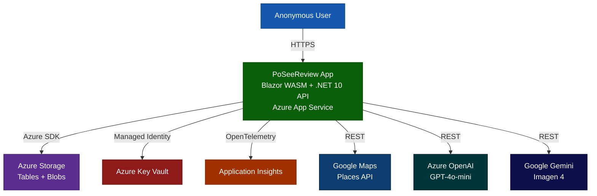

# ProductSpec — PoSeeReview

> **"Turning Real Reviews into Surreal Stories"**
> Transforms real restaurant reviews into AI-generated four-panel comic strips. No account required.

---

## Why This Exists

Restaurant reviews are information-dense but rarely fun. Users already read reviews to decide where to eat — SeeReview makes that discovery *entertaining and shareable* by transforming the strangest real experiences into visual comics. The "strangeness score" creates a natural leaderboard mechanic that rewards discovery and drives return visits.

---

## Target Audience

| Persona | Need |
|---|---|
| **Curious Diner** | Wants funny, visual restaurant intel before committing to a reservation |
| **Social Sharer** | Looks for natively-shareable content (Web Share API, clipboard fallback) |
| **Local Explorer** | Browses a city's Hall of Fame to find the weirdest dining destinationsng |
| **Restaurant Owner** | Needs a DMCA-style takedown mechanism if content is inaccurate or harmful |

---

## Feature Definitions

### Epic 1 — Restaurant Discovery
- **GPS auto-detection**: browser Geolocation API, fallback to text search by city or ZIP
- **Google Maps integration**: finds 10 nearest restaurants within 5km, pulls up to 5 reviews each
- **Restaurant grid**: skeleton loading state → card tiles with name, address, rating, distance
- **Search endpoint**: `GET /api/restaurants/search?query&lat&lon`

### Epic 2 — Comic Generation Pipeline
1. Validate ≥5 reviews exist (`InsufficientReviewsException` otherwise)
2. Prioritise 1-star reviews; cap at 5 reviews sent to AI
3. **Azure OpenAI GPT-4o-mini** → `StrangenessScore` (0–100) + narrative paragraph
4. **Google Gemini Imagen 4** (`imagen-4.0-fast-generate-001`) → four-panel PNG
5. Optional: text overlay via `ComicTextOverlayService`
6. Upload PNG to Azure Blob Storage (`comics` container)
7. Save `ComicEntity` to Azure Table Storage with 7-day TTL
8. If `StrangenessScore ≥ 20`: upsert into leaderboard

**Rate limits**: 3 comic generation requests/min per IP. Global cap: 60 req/min/IP.

### Epic 3 — Social & Leaderboard
- **Hall of Fame**: `GET /api/leaderboard?region=CC-ST-CITY&limit=10` (1–50 entries)
- **Regions supported**: US, CA, GB, AU, NZ, IE, IN, SG
- **Auto-refresh**: every 30 seconds in Blazor client
- **Share button**: Web Share API → clipboard fallback
- **Takedown requests**: `POST /api/takedowns` removes comic + blob + leaderboard entry (202 Accepted)

### Background Operations
- `ExpiredComicCleanupService`: runs every 30 minutes, deletes expired comics in batches of 25

---

## Business Rules

| Rule | Value |
|---|---|
| Minimum reviews to generate comic | **5** |
| Max reviews sent to AI | **5** |
| Comic cache TTL | **7 days** |
| Minimum strangeness score for leaderboard | **20 / 100** |
| Global rate limit | **60 req/min per IP** |
| Comic generation rate limit | **3 req/min per IP** |
| Rate limit retry window | **60 seconds** (`Retry-After` header) |
| Cleanup batch size | **25 expired comics per run** |
| Cleanup interval | **30 minutes** |
| Blob container | `comics` |
| Tables | `PoSeeReviewComics`, `PoSeeReviewRestaurants`, `PoSeeReviewLeaderboard` |

---

## Success Metrics (KPIs)

| Metric | Target |
|---|---|
| Average session duration | ≥ 2 minutes |
| Comic share rate | ≥ 30% of comic views result in a share action |
| Comic generation latency (p95) | ≤ 10 seconds end-to-end |
| Comic generation success rate | ≥ 95% (excluding InsufficientReviews) |
| Page load time (p95) | ≤ 3 seconds on broadband |
| Cache hit rate | ≥ 60% of comic requests served from cache |
| Leaderboard engagement | ≥ 20% of sessions visit `/leaderboard` |

---

## Acceptance Criteria

| Feature | Criteria |
|---|---|
| Location detection | GPS prompt on first load; degrades gracefully to manual search if denied |
| Restaurant grid | Skeleton loader visible during API call; cards populated ≤ 3s on broadband |
| Comic generation | Comic rendered on `/comic/{placeId}`; score ring, share button, force-refresh present |
| Cache indicator | `IsCached=true` badge visible on cached comics |
| Strangeness ring | SVG ring correctly reflects `StrangenessScore` 0–100 |
| Share | Web Share API invoked on supported browsers; clipboard fallback on others |
| Leaderboard | Region selector filters results; medal icons for top 3; auto-refreshes every 30s |
| Takedown | `POST /api/takedowns` returns 202; comic, blob, and leaderboard entry removed immediately |
| Rate limiting | 429 with `Retry-After: 60` header returned on comic endpoint beyond 3/min/IP |
| Health check | `/api/health` returns Healthy when all dependencies reachable; Degraded/Unhealthy otherwise |
| Bot protection | Requests with non-browser `User-Agent` receive 403 (bypassed by `DISABLE_USER_AGENT_VALIDATION=true`) |
| Security | Secrets never in source control; Key Vault loaded at startup via Managed Identity |
| Diagnostics | `/diag` page visible only in Development; secrets masked with `***` |

---

## Architecture Overview

See [Architecture.mmd](./Architecture.mmd) for the full C4 Level 1 system context diagram.
