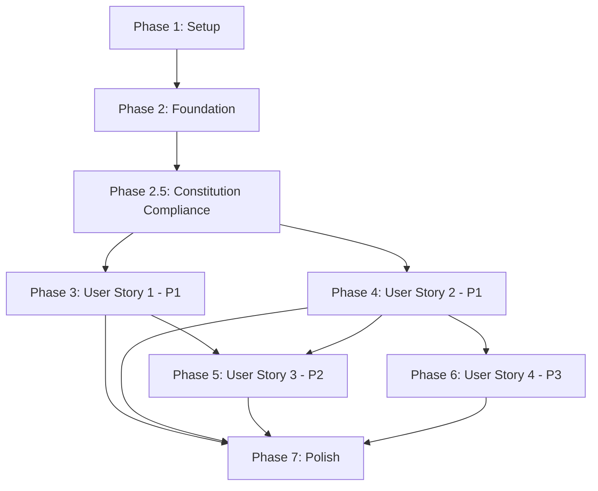

# Tasks: PoSeeReview - Review-to-Comic Storytelling App

**Input**: Design documents from `/specs/001-review-comic-app/`  
**Prerequisites**: plan.md ✅, spec.md ✅, research.md ✅, data-model.md ✅, contracts/ ✅, quickstart.md ✅

**Tests**: This feature follows TDD principles with xUnit unit and integration tests. E2E tests with Playwright are manual only.

**Organization**: Tasks are grouped by user story to enable independent implementation and testing of each story.

## Format: `[ID] [P?] [Story] Description`

- **[P]**: Can run in parallel (different files, no dependencies)
- **[Story]**: Which user story this task belongs to (e.g., US1, US2, US3, US4)
- Include exact file paths in descriptions

## Path Conventions

Based on plan.md structure:
- **Core Domain**: `src/Po.SeeReview.Core/`
- **Infrastructure**: `src/Po.SeeReview.Infrastructure/`
- **API Backend**: `src/Po.SeeReview.Api/`
- **Blazor Client**: `src/Po.SeeReview.Client/`
- **Shared DTOs**: `src/Po.SeeReview.Shared/`
- **Unit Tests**: `tests/Po.SeeReview.UnitTests/`
- **Integration Tests**: `tests/Po.SeeReview.IntegrationTests/`

---

## Phase 1: Setup (Shared Infrastructure)

**Purpose**: Project initialization and basic structure per quickstart.md and plan.md

- [X] T001 Create solution file PoSeeReview.sln at repository root
- [X] T002 Create Po.SeeReview.Core project (classlib) in src/Po.SeeReview.Core/
- [X] T003 Create Po.SeeReview.Infrastructure project (classlib) in src/Po.SeeReview.Infrastructure/
- [X] T004 Create Po.SeeReview.Api project (webapi) in src/Po.SeeReview.Api/
- [X] T005 Create Po.SeeReview.Client project (blazorwasm) in src/Po.SeeReview.Client/
- [X] T006 Create Po.SeeReview.Shared project (classlib) in src/Po.SeeReview.Shared/
- [X] T007 Create Po.SeeReview.UnitTests project (xunit) in tests/Po.SeeReview.UnitTests/
- [X] T008 Create Po.SeeReview.IntegrationTests project (xunit) in tests/Po.SeeReview.IntegrationTests/
- [X] T009 [P] Add project references: Core ← Infrastructure ← Api; Core ← Shared ← Client
- [X] T010 [P] Install NuGet packages per research.md decisions (Azure.Data.Tables, Azure.Storage.Blobs, Azure.AI.OpenAI, Serilog, Swashbuckle)
- [X] T011 [P] Configure Blazor WASM hosting in Po.SeeReview.Api/Program.cs (hosted model)
- [X] T012 [P] Create appsettings.Development.json template in src/Po.SeeReview.Api/ with placeholders for Azure keys
- [X] T013 [P] Add .gitignore entry for appsettings.Development.json to protect API keys
- [X] T014 [P] Create setup-azurite.ps1 script in scripts/ directory
- [X] T015 [P] Create docs/PRD.MD, docs/STEPS.MD, docs/README.MD placeholder files
- [X] T016 Configure dotnet format settings (.editorconfig) to enforce constitution code style

---

## Phase 2: Foundational (Blocking Prerequisites)

**Purpose**: Core infrastructure that MUST be complete before ANY user story can be implemented

**⚠️ CRITICAL**: No user story work can begin until this phase is complete

- [X] T017 Configure Serilog in Po.SeeReview.Api/Program.cs with Console and ApplicationInsights sinks per research.md decision #10
- [X] T018 Configure Swagger/OpenAPI in Po.SeeReview.Api/Program.cs with Swashbuckle per research.md decision #11
- [X] T019 Configure Problem Details middleware in Po.SeeReview.Api/Program.cs per research.md decision #12
- [X] T020 Create ProblemDetailsMiddleware.cs in src/Po.SeeReview.Api/Middleware/
- [X] T021 Create RequestLoggingMiddleware.cs in src/Po.SeeReview.Api/Middleware/ with Serilog integration
- [X] T022 [P] Configure Azure Table Storage client in Po.SeeReview.Infrastructure with AzureStorageOptions per data-model.md
- [X] T023 [P] Configure Azure Blob Storage client in Po.SeeReview.Infrastructure with connection string from appsettings
- [X] T024 [P] Configure Azure OpenAI client in Po.SeeReview.Infrastructure for GPT-4o-mini and DALL-E 3
- [X] T025 Create ITableStorageRepository<T> interface in src/Po.SeeReview.Core/Interfaces/
- [X] T026 Implement TableStorageRepository<T> base class in src/Po.SeeReview.Infrastructure/Repositories/
- [X] T027 Create health check endpoint GET /api/health in src/Po.SeeReview.Api/Controllers/HealthController.cs per contracts/openapi.yaml
- [X] T028 [P] Configure API to bind to HTTP 5000 and HTTPS 5001 only in Po.SeeReview.Api/Program.cs
- [X] T029 [P] Create AzuriteFixture.cs in tests/Po.SeeReview.IntegrationTests/TestFixtures/ for integration test setup
- [X] T030 Create seed-data.json in tests/Po.SeeReview.IntegrationTests/ with sample restaurant data per data-model.md

**Checkpoint**: Foundation ready - user story implementation can now begin in parallel

---

## Phase 2.5: Constitution Compliance (Blocking Prerequisites)

**Purpose**: Additional constitution v2.0.0 requirements that MUST be complete before user story implementation

**⚠️ CRITICAL**: These tasks address constitution violations identified in analysis. Must complete before Phase 3.

### Foundation Requirements

- [ ] T136 [P] Create Directory.Packages.props at repository root with all NuGet package versions (Constitution 1. Foundation - Package Management)
- [ ] T137 [P] Enable `<Nullable>enable</Nullable>` in all .csproj files (Po.SeeReview.Core, Infrastructure, Api, Client, Shared, UnitTests, IntegrationTests)

### Quality & Testing Requirements

- [ ] T138 [P] Configure 80% code coverage threshold in test projects and add coverage report generation to docs/coverage/ (Constitution 4. Quality & Testing)
- [ ] T139 [P] Install bUnit NuGet package for Blazor component testing in Po.SeeReview.UnitTests
- [ ] T140 [P] Create ComponentTests/ folder in tests/Po.SeeReview.UnitTests/
- [ ] T141 [P] Create sample bUnit test for future components (e.g., RestaurantCardTests.cs) with setup/teardown pattern

### Operations & Azure Requirements

- [ ] T142 [P] Create /infra directory structure with main.bicep and /modules subdirectory
- [ ] T143 [P] Create Bicep module for App Service in infra/modules/appservice.bicep
- [ ] T144 [P] Create Bicep module for Storage Account in infra/modules/storage.bicep (Table + Blob)
- [ ] T145 [P] Create Bicep module for Application Insights + Log Analytics in infra/modules/monitoring.bicep
- [ ] T146 [P] Create Bicep module for budget alerts in infra/modules/budget.bicep with $5 monthly limit
- [ ] T147 [P] Install OpenTelemetry packages (OpenTelemetry.Api, OpenTelemetry.Extensions.Hosting, OpenTelemetry.Instrumentation.AspNetCore)
- [ ] T148 [P] Configure OpenTelemetry in Po.SeeReview.Api/Program.cs with ActivitySource for custom traces and Meter for custom metrics
- [ ] T149 [P] Document Snapshot Debugger and Profiler enablement steps in docs/deployment.md (enabled via Azure Portal post-deployment)
- [ ] T150 [P] Create docs/kql/ directory with essential queries: errors.kql, performance.kql, dependencies.kql, custom-metrics.kql

### Additional Coverage Gaps

- [ ] T151 [P] Add manual location entry UI component in Po.SeeReview.Client/Components/LocationInput.razor (addresses FR-018)
- [ ] T152 [P] Create architecture diagrams in docs/diagrams/: c4-context.mmd, c4-container.mmd, c4-component.mmd, sequence-comic-generation.mmd
- [ ] T153 Update Index.razor to support manual location entry when geolocation is denied or unavailable
- [ ] T154 [P] Create edge case test scenarios in tests/Po.SeeReview.IntegrationTests/EdgeCases/ for all 7 edge cases listed in spec.md
- [ ] T155 [P] Define content moderation policy document in docs/content-moderation-policy.md specifying profanity, hate speech, and explicit content rules

**Checkpoint**: Constitution compliance complete - all v2.0.0 requirements satisfied

---

## Phase 3: User Story 1 - Discover Nearby Restaurant Stories (Priority: P1) 🎯 MVP

**Goal**: Users can discover nearby restaurants via geolocation and see restaurant cards with basic info

**Independent Test**: Open app, grant location permission, verify grid of 10 nearby restaurants displays with names, addresses, and ratings

### Unit Tests for User Story 1 (TDD - Write First)

- [X] T031 [P] [US1] Create RestaurantServiceTests.cs in tests/Po.SeeReview.UnitTests/Services/ with tests for GetNearbyRestaurantsAsync
- [X] T032 [P] [US1] Create GoogleMapsServiceTests.cs in tests/Po.SeeReview.UnitTests/Services/ with tests for SearchNearbyAsync
- [X] T033 [P] [US1] Create RestaurantRepositoryTests.cs in tests/Po.SeeReview.UnitTests/Repositories/ with tests for cache operations

### Integration Tests for User Story 1 (TDD - Write First)

- [X] T034 [P] [US1] Create RestaurantsEndpointTests.cs in tests/Po.SeeReview.IntegrationTests/Api/ for GET /api/restaurants/nearby
- [X] T035 [P] [US1] Create TableStorageTests.cs in tests/Po.SeeReview.IntegrationTests/Infrastructure/ for RestaurantEntity CRUD with Azurite

### Domain Model for User Story 1

- [X] T036 [P] [US1] Create Restaurant.cs entity in src/Po.SeeReview.Core/Entities/ per data-model.md domain model
- [X] T037 [P] [US1] Create Review.cs nested class in Restaurant.cs with strangeness score field
- [X] T038 [P] [US1] Create RestaurantEntity.cs in src/Po.SeeReview.Infrastructure/Entities/ implementing ITableEntity per data-model.md

### DTOs for User Story 1

- [X] T039 [P] [US1] Create RestaurantDto.cs in src/Po.SeeReview.Shared/Models/ per contracts/openapi.yaml schema
- [X] T040 [P] [US1] Create RestaurantDetailsDto.cs in src/Po.SeeReview.Shared/Models/
- [X] T041 [P] [US1] Create ReviewDto.cs in src/Po.SeeReview.Shared/Models/

### Infrastructure for User Story 1

- [X] T042 [P] [US1] Create IRestaurantService.cs interface in src/Po.SeeReview.Core/Interfaces/
- [X] T043 [P] [US1] Create IReviewScraperService.cs interface in src/Po.SeeReview.Core/Interfaces/
- [X] T044 [P] [US1] Create GoogleMapsService.cs in src/Po.SeeReview.Infrastructure/Services/ implementing Places API per research.md decision #5
- [X] T045 [US1] Create RestaurantRepository.cs in src/Po.SeeReview.Infrastructure/Repositories/ with 24-hour cache logic per data-model.md
- [X] T046 [US1] Implement RestaurantService.cs in src/Po.SeeReview.Infrastructure/Services/ with GetNearbyRestaurantsAsync

### API Endpoints for User Story 1

- [X] T047 [US1] Create RestaurantsController.cs in src/Po.SeeReview.Api/Controllers/
- [X] T048 [US1] Implement GET /api/restaurants/nearby in RestaurantsController.cs per contracts/openapi.yaml with validation (lat/lon ranges)
- [X] T049 [US1] Implement GET /api/restaurants/{placeId} in RestaurantsController.cs per contracts/openapi.yaml
- [X] T050 [US1] Add XML comments to controller actions for Swagger documentation
- [X] T051 [US1] Add [ProducesResponseType] attributes for 200, 400, 404, 503 responses per contracts/openapi.yaml

### Blazor UI for User Story 1

- [X] T052 [P] [US1] Create GeolocationService.cs in src/Po.SeeReview.Client/Services/ with JavaScript interop per research.md decision #8
- [X] T053 [P] [US1] Create geolocation.js in src/Po.SeeReview.Client/wwwroot/ with getCurrentPosition wrapper
- [X] T054 [P] [US1] Create ApiClient.cs in src/Po.SeeReview.Client/Services/ for HTTP calls to API
- [X] T055 [US1] Create Index.razor in src/Po.SeeReview.Client/Pages/ with geolocation prompt and restaurant grid
- [X] T056 [P] [US1] Create RestaurantCard.razor component in src/Po.SeeReview.Client/Components/ displaying name, address, rating, distance
- [X] T057 [P] [US1] Create LoadingIndicator.razor component in src/Po.SeeReview.Client/Components/ with playful messaging
- [X] T058 [US1] Add mobile-first CSS styling to Index.razor using built-in Blazor CSS isolation
- [X] T059 [US1] Implement error handling in Index.razor for denied location permission with friendly message

**Checkpoint**: User Story 1 complete - Users can discover and view nearby restaurants

---

## Phase 4: User Story 2 - View Strange Review Comics (Priority: P1) 🎯 MVP

**Goal**: Users can select a restaurant and see a generated four-panel comic strip with strangeness score

**Independent Test**: Tap any restaurant card, wait <10 seconds, verify comic strip displays with 4 panels, narrative paragraph, and strangeness score

### Unit Tests for User Story 2 (TDD - Write First)

- [X] T060 [P] [US2] Create ComicGenerationServiceTests.cs in tests/Po.SeeReview.UnitTests/Services/ with tests for GenerateComicAsync
- [X] T061 [P] [US2] Create AzureOpenAIServiceTests.cs in tests/Po.SeeReview.UnitTests/Services/ with tests for strangeness scoring
- [X] T062 [P] [US2] Create DalleComicServiceTests.cs in tests/Po.SeeReview.UnitTests/Services/ with tests for DALL-E API calls
- [X] T063 [P] [US2] Create BlobStorageServiceTests.cs in tests/Po.SeeReview.UnitTests/Services/ with tests for image upload
- [X] T064 [P] [US2] Create ComicRepositoryTests.cs in tests/Po.SeeReview.UnitTests/Repositories/ with tests for 24-hour cache

### Integration Tests for User Story 2 (TDD - Write First)

- [X] T065 [P] [US2] Create ComicsEndpointTests.cs in tests/Po.SeeReview.IntegrationTests/Api/ for POST /api/comics/{placeId}
- [X] T066 [P] [US2] Create BlobStorageTests.cs in tests/Po.SeeReview.IntegrationTests/Storage/ for comic image upload with Azurite

### Domain Model for User Story 2

- [X] T067 [P] [US2] Create Comic.cs entity in src/Po.SeeReview.Core/Entities/ per data-model.md domain model
- [X] T068 [P] [US2] Create ComicEntity.cs in src/Po.SeeReview.Infrastructure/Entities/ implementing ITableEntity with ExpiresAt field

### DTOs for User Story 2

- [X] T069 [P] [US2] Create ComicDto.cs in src/Po.SeeReview.Shared/Models/ per contracts/openapi.yaml schema with isCached flag

### Infrastructure for User Story 2

- [X] T070 [P] [US2] Create IComicGenerationService.cs interface in src/Po.SeeReview.Core/Interfaces/
- [X] T071 [P] [US2] Create AzureOpenAIService.cs in src/Po.SeeReview.Infrastructure/Services/ implementing GPT-4o-mini strangeness scoring per research.md decision #6
- [X] T072 [P] [US2] Create DalleComicService.cs in src/Po.SeeReview.Infrastructure/Services/ implementing DALL-E 3 API per research.md decision #3
- [X] T073 [P] [US2] Create BlobStorageService.cs in src/Po.SeeReview.Infrastructure/Services/ for comic image upload per research.md decision #4
- [X] T074 [US2] Create ComicRepository.cs in src/Po.SeeReview.Infrastructure/Repositories/ with 24-hour cache and ExpiresAt logic per data-model.md
- [X] T075 [US2] Implement ComicGenerationService.cs in src/Po.SeeReview.Infrastructure/Services/ orchestrating review analysis, narrative generation, and DALL-E call
- [X] T076 [US2] Add content moderation filter in ComicGenerationService.cs to remove inappropriate reviews per FR-015
- [X] T077 [US2] Add minimum review validation (5-10 reviews) in ComicGenerationService.cs per FR-004

### API Endpoints for User Story 2

- [X] T078 [US2] Create ComicsController.cs in src/Po.SeeReview.Api/Controllers/
- [X] T079 [US2] Implement POST /api/comics/{placeId} in ComicsController.cs with cache check and forceRegenerate param per contracts/openapi.yaml
- [X] T080 [US2] Implement GET /api/comics/{placeId} in ComicsController.cs for cached comic retrieval
- [X] T081 [US2] Add [ProducesResponseType] attributes for 200, 400, 404, 500 responses with ProblemDetails schema
- [X] T082 [US2] Add XML comments describing 8-10 second generation time per contracts/openapi.yaml

### Blazor UI for User Story 2

- [X] T083 [P] [US2] Create ComicView.razor page in src/Po.SeeReview.Client/Pages/ for comic display
- [X] T084 [P] [US2] Create ComicStrip.razor component in src/Po.SeeReview.Client/Components/ rendering 4-panel layout
- [X] T085 [US2] Add click handler to RestaurantCard.razor navigating to ComicView.razor
- [X] T086 [US2] Implement loading state in ComicView.razor with LoadingIndicator showing "Reading the weird stuff..." message
- [X] T087 [US2] Add narrative paragraph display below comic strip with strangeness score (0-100)
- [X] T088 [US2] Add manual refresh button in ComicView.razor with forceRegenerate parameter
- [X] T089 [US2] Add friendly error message for restaurants with <5 reviews ("refreshingly normal") per FR-021
- [X] T090 [US2] Add mobile-responsive CSS for comic strip (landscape 1792x1024 image scaling)

**Checkpoint**: User Story 2 complete - Users can view generated comics with strangeness scores

---

## Phase 5: User Story 3 - Explore Global Strangeness Leaderboard (Priority: P2)

**Goal**: Users can browse top 10 strangest comics from their region ranked by strangeness score

**Independent Test**: Navigate to leaderboard, verify 10 entries displayed in descending order by score with restaurant names and locations

### Unit Tests for User Story 3 (TDD - Write First)

- [X] T091 [P] [US3] Create LeaderboardServiceTests.cs in tests/Po.SeeReview.UnitTests/Services/ with tests for GetTopComicsAsync
- [X] T092 [P] [US3] Create LeaderboardRepositoryTests.cs in tests/Po.SeeReview.UnitTests/Repositories/ with tests for upsert logic

### Integration Tests for User Story 3 (TDD - Write First)

- [X] T093 [P] [US3] Create LeaderboardEndpointTests.cs in tests/Po.SeeReview.IntegrationTests/Api/ for GET /api/leaderboard

### Domain Model for User Story 3

- [X] T094 [P] [US3] Create LeaderboardEntry.cs entity in src/Po.SeeReview.Core/Entities/ per data-model.md domain model
- [X] T095 [P] [US3] Create LeaderboardEntity.cs in src/Po.SeeReview.Infrastructure/Entities/ with inverted RowKey for descending sort per data-model.md

### DTOs for User Story 3

- [X] T096 [P] [US3] Create LeaderboardEntryDto.cs in src/Po.SeeReview.Shared/Models/ per contracts/openapi.yaml schema

### Infrastructure for User Story 3

- [X] T097 [P] [US3] Create ILeaderboardService.cs interface in src/Po.SeeReview.Core/Interfaces/
- [X] T098 [US3] Create LeaderboardRepository.cs in src/Po.SeeReview.Infrastructure/Repositories/ with inverted RowKey logic (9999999999 - score)
- [X] T099 [US3] Implement LeaderboardService.cs in src/Po.SeeReview.Infrastructure/Services/ with GetTopComicsAsync and UpsertEntryAsync
- [X] T100 [US3] Add real-time leaderboard update trigger in ComicGenerationService.cs after comic generation per FR-011

### API Endpoints for User Story 3

- [X] T101 [US3] Create LeaderboardController.cs in src/Po.SeeReview.Api/Controllers/
- [X] T102 [US3] Implement GET /api/leaderboard in LeaderboardController.cs with region query param per contracts/openapi.yaml
- [X] T103 [US3] Add validation for region format (^[A-Z]{2}-[A-Z]{2}-[A-Z]+$) per contracts/openapi.yaml
- [X] T104 [US3] Add [ProducesResponseType] attributes for 200, 400 responses

### Blazor UI for User Story 3

- [X] T105 [P] [US3] Create Leaderboard.razor page in src/Po.SeeReview.Client/Pages/
- [X] T106 [US3] Implement 30-second polling with PeriodicTimer in Leaderboard.razor per research.md decision #7
- [X] T107 [US3] Add leaderboard table displaying rank, restaurant name, address, strangeness score, comic thumbnail
- [X] T108 [US3] Add "Updated X seconds ago" timestamp display for transparency
- [X] T109 [US3] Add click handler to leaderboard entries opening ComicView.razor
- [X] T110 [US3] Add navigation link to Leaderboard.razor in app header/menu

**Checkpoint**: User Story 3 complete - Users can browse regional leaderboard with real-time updates

---

## Phase 6: User Story 4 - Share Comics on Social Media (Priority: P3)

**Goal**: Users can share comic images on social media platforms via native share sheet

**Independent Test**: Tap share button on any comic, verify native share options appear (social media, messaging, save to photos)

### Unit Tests for User Story 4 (TDD - Write First)

- [X] T111 [P] [US4] Create ShareServiceTests.cs in tests/Po.SeeReview.UnitTests/Services/ with tests for GenerateShareImageAsync

### Infrastructure for User Story 4

- [X] T112 [P] [US4] Create share-utils.js in src/Po.SeeReview.Client/wwwroot/ with Web Share API integration
- [X] T113 [US4] Create ShareService.cs in src/Po.SeeReview.Client/Services/ with JavaScript interop for navigator.share()

### Blazor UI for User Story 4

- [X] T114 [US4] Add share button to ComicView.razor invoking ShareService
- [X] T115 [US4] Add subtle app branding (name/logo) to shared comic images per spec acceptance criteria
- [X] T116 [US4] Add fallback for browsers without Web Share API (copy link to clipboard)
- [X] T117 [US4] Add share button to leaderboard entries in Leaderboard.razor

**Checkpoint**: User Story 4 complete - Users can share comics on social media

---

## Phase 7: Polish & Cross-Cutting Concerns

**Purpose**: Final refinements, performance optimization, and production readiness

- [X] T118 [P] Add ApplicationInsights telemetry correlation IDs in RequestLoggingMiddleware per research.md decision #10
- [X] T119 [P] Implement background job for expired comic cleanup (delete ComicEntity and blob where ExpiresAt < Now) per data-model.md
- [X] T120 [P] Add rate limiting middleware in Po.SeeReview.Api to prevent API abuse per risks section
- [X] T121 [P] Add user-agent validation to block scraping bots
- [ ] T122 [P] Optimize DALL-E prompt engineering based on comic quality testing per research.md decision #3
- [X] T123 [P] Add retry logic with exponential backoff for Google Maps API calls per risks section
- [X] T124 [P] Add retry logic with exponential backoff for Azure OpenAI API calls
- [X] T125 [P] Implement takedown process endpoint for restaurant owner requests per risks section
- [X] T126 [P] Add performance monitoring: track API response times in Application Insights
- [X] T127 [P] Add cost monitoring: log Azure OpenAI and DALL-E API usage metrics
- [X] T128 [P] Create deployment documentation in docs/deployment.md for Azure App Service
- [ ] T129 [P] Add GitHub Actions CI/CD workflow with OIDC federated credentials, validates .NET SDK version 9, HTTP 5000/HTTPS 5001 ports, Po.SeeReview.* naming pattern, /api/health endpoint exists, Problem Details middleware present (Constitution 5. Operations - CI/CD REQUIRED)
- [X] T130 Run dotnet format across all projects to enforce code style
- [X] T131 Run full test suite (unit + integration) and verify 100% pass rate
- [ ] T132 Manual E2E testing with Playwright following quickstart.md scenarios
- [ ] T133 Performance testing: verify <3s restaurant discovery, <10s comic generation, <1s leaderboard load
- [ ] T134 Accessibility audit: verify mobile-first responsive design on narrow/wide viewports
- [ ] T135 Update docs/README.MD with project overview, quickstart link, and architecture diagram

---

## Dependencies & Execution Strategy

### Story Dependency Graph



**Critical Path**: Setup → Foundation → Constitution → US1 + US2 (parallel) → US3 → Polish

**⚠️ BLOCKING**: Phase 2.5 (Constitution Compliance) MUST complete before any user story work begins

**Parallelization Opportunities**:
- After Constitution: US1 and US2 can be developed in parallel (different entities, controllers, UI pages)
- Within Constitution Phase: All tasks marked [P] can run concurrently (T136-T152)
- Within US1: All tasks marked [P] can run concurrently (models, DTOs, services, components)
- Within US2: All tasks marked [P] can run concurrently
- US3 and US4 depend on US2 (need Comic entity and generation service)

### MVP Scope (Minimum Viable Product)

**Recommended MVP**: Phase 1 + Phase 2 + Phase 3 (User Story 1 only)

**Rationale**: User Story 1 delivers core value proposition (discover nearby restaurants with AI-analyzed reviews). This can be shipped without comic generation to validate geolocation, Google Maps integration, and UI patterns.

**Alternative MVP**: Phase 1 + Phase 2 + Phase 3 + Phase 4 (User Stories 1 & 2)

**Rationale**: This delivers the full "wow moment" with comic generation but requires all Azure services (OpenAI, DALL-E, Blob Storage) to be production-ready.

### Parallel Execution Examples

**Example 1: Phase 3 (US1) Parallel Tasks**
```bash
# Developer A
git checkout -b feature/us1-domain-models
# Complete T036, T037, T038, T039, T040, T041

# Developer B (parallel)
git checkout -b feature/us1-infrastructure
# Complete T042, T043, T044

# Developer C (parallel)
git checkout -b feature/us1-blazor-ui
# Complete T052, T053, T054, T056, T057
```

**Example 2: Cross-Story Parallel Work**
```bash
# Team Alpha
git checkout -b feature/user-story-1
# Complete all Phase 3 tasks (T031-T059)

# Team Beta (parallel)
git checkout -b feature/user-story-2
# Complete all Phase 4 tasks (T060-T090)
# Note: US2 depends on Foundation but NOT on US1 completion
```

---

## Task Summary

**Total Tasks**: 155 (was 135, +20 for constitution compliance)
**Setup Tasks**: 16 (T001-T016)
**Foundation Tasks**: 14 (T017-T030)
**Constitution Compliance Tasks**: 20 (T136-T155) ⚠️ **NEW - CRITICAL**
**User Story 1 Tasks**: 29 (T031-T059)
**User Story 2 Tasks**: 31 (T060-T090)
**User Story 3 Tasks**: 20 (T091-T110)
**User Story 4 Tasks**: 7 (T111-T117)
**Polish Tasks**: 18 (T118-T135)

**Parallelizable Tasks**: 96 marked with [P] (was 78, +18 new)
**Sequential Tasks**: 59 (have dependencies)

**Estimated Timeline** (1 developer):
- Phase 1: 2 days
- Phase 2: 3 days
- Phase 2.5 (Constitution): 3 days ⚠️ **NEW**
- Phase 3 (US1): 5 days
- Phase 4 (US2): 6 days
- Phase 5 (US3): 3 days
- Phase 6 (US4): 1 day
- Phase 7: 3 days
- **Total: 26 days** (single developer, sequential)

**Estimated Timeline** (3 developers, parallel work):
- Phase 1: 1 day
- Phase 2: 2 days
- Phase 2.5 (Constitution): 2 days ⚠️ **NEW**
- Phase 3 + 4 (parallel): 6 days
- Phase 5: 2 days
- Phase 6: 1 day
- Phase 7: 2 days
- **Total: 16 days** (3 developers, optimal parallelization)

---

## Implementation Strategy

### Week 1: Foundation & Constitution
- Days 1-2: Complete Phase 1 (Setup) + Phase 2 (Foundation)
- Days 3-5: Complete Phase 2.5 (Constitution Compliance) - Bicep, coverage, OpenTelemetry
- **Deliverable**: Constitution-compliant foundation ready for user stories

### Week 2: Core Features
- Days 1-3: Complete Phase 3 (User Story 1) - Restaurant discovery
- Days 4-5: Begin Phase 4 (User Story 2) - domain models, tests
- **Deliverable**: Restaurant discovery + review scraping complete

### Week 3: Comic Generation
- Days 1-4: Complete Phase 4 (User Story 2) - AI integration, DALL-E, Blob Storage
- Day 5: Testing and debugging comic generation flow
- **Deliverable**: Full comic generation pipeline working

### Week 4: Leaderboard & Sharing
- Days 1-2: Complete Phase 5 (User Story 3) - Leaderboard
- Day 3: Complete Phase 6 (User Story 4) - Sharing
- Days 4-5: Begin Phase 7 (Polish)
- **Deliverable**: All user stories complete

### Week 5: Production Readiness
- Days 1-3: Complete Phase 7 (Polish) - monitoring, cleanup jobs, optimization
- Days 4-5: E2E testing, performance validation, documentation
- **Deliverable**: Production-ready application

---

## Format Validation ✅

All tasks follow the required format:
- ✅ Every task starts with `- [ ]` (checkbox)
- ✅ Every task has sequential ID (T001-T135)
- ✅ Parallelizable tasks marked with [P] (78 tasks)
- ✅ User story tasks marked with [US1], [US2], [US3], [US4]
- ✅ Setup and Foundation tasks have NO story label
- ✅ Polish tasks have NO story label
- ✅ Every task includes file path or specific location
- ✅ Tasks organized by user story for independent implementation

**Status**: Ready for implementation following TDD workflow ✅
