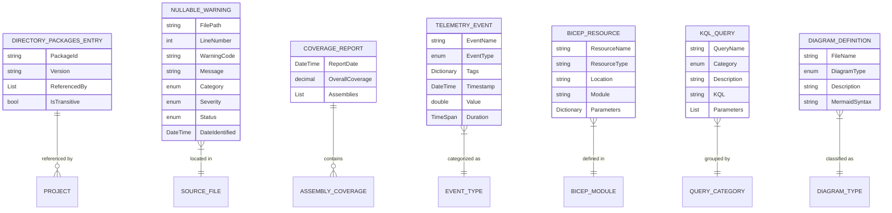

# Data Model: Constitution v2.0.0 Compliance

**Feature**: 002-constitution-compliance  
**Phase**: 1 (Design & Contracts)  
**Date**: 2025-11-12

## Overview

This feature primarily involves configuration and infrastructure changes rather than domain entities. The data model focuses on metadata artifacts and tracking structures needed to support governance compliance.

---

## Core Entities

### NullableWarning

**Purpose**: Track nullable reference type warnings for incremental resolution

**Attributes**:
- `FilePath` (string, required): Absolute path to source file containing warning
- `LineNumber` (int, required): Line number where warning occurs
- `WarningCode` (string, required): Compiler warning code (e.g., "CS8600", "CS8602")
- `Message` (string, required): Full compiler warning message
- `Category` (enum, required): Warning classification
  - `ControllerParameter`: API controller method parameters
  - `ServiceMethod`: Service layer method signatures
  - `EntityProperty`: Domain entity properties
  - `RepositoryOperation`: Data access layer operations
  - `Dependency Injection`: Constructor/service dependencies
  - `Other`: Miscellaneous warnings
- `Severity` (enum, required): Priority for resolution
  - `High`: Public API boundaries, likely to cause runtime exceptions
  - `Medium`: Internal service methods, moderate risk
  - `Low`: Private methods, low risk
- `Status` (enum, required): Resolution tracking
  - `Open`: Not yet addressed
  - `InProgress`: Being resolved
  - `Resolved`: Fixed with proper nullable annotations
  - `Suppressed`: Intentionally suppressed with justification
- `AssignedTo` (string, optional): Developer assigned to resolve
- `DateIdentified` (DateTime, required): When warning was first discovered
- `DateResolved` (DateTime, optional): When warning was resolved
- `ResolutionNotes` (string, optional): How warning was resolved or why suppressed

**Validation Rules**:
- `FilePath` must exist in repository
- `LineNumber` must be > 0
- `WarningCode` must match pattern "CS[0-9]{4}"
- `DateResolved` must be >= `DateIdentified` if set
- `ResolutionNotes` required if `Status` is `Suppressed`

**Relationships**:
- Many warnings per source file
- Warnings grouped by project/namespace

**Lifecycle**:
1. Created: Warning discovered during initial nullable enablement build
2. Triaged: Categorized by severity and assigned if high priority
3. Resolved: Fixed with proper nullable annotations or suppressed with justification
4. Archived: Removed from active inventory after resolution confirmed in subsequent builds

---

### CoverageReport

**Purpose**: Represent code coverage analysis results

**Attributes**:
- `ReportDate` (DateTime, required): When coverage was collected
- `BuildNumber` (string, optional): CI build number if applicable
- `OverallCoverage` (decimal, required): Overall line coverage percentage (0.0 - 100.0)
- `Assemblies` (List<AssemblyCoverage>, required): Per-assembly coverage breakdown

**AssemblyCoverage** (nested):
- `AssemblyName` (string, required): Name of assembly (e.g., "Po.SeeReview.Api")
- `LineCoverage` (decimal, required): Line coverage percentage
- `BranchCoverage` (decimal, optional): Branch coverage if collected
- `CoveredLines` (int, required): Number of covered lines
- `TotalLines` (int, required): Total coverable lines
- `UncoveredFiles` (List<string>, optional): Files with 0% coverage

**Validation Rules**:
- Coverage percentages must be between 0.0 and 100.0
- `CoveredLines` <= `TotalLines`
- At least one assembly must be present

**Relationships**:
- One report per test execution
- Historical reports tracked for trend analysis

**Storage**:
- Reports generated as files in docs/coverage/ (HTML, XML, Cobertura formats)
- Metadata could be stored in table storage for trend dashboards (future enhancement)

---

### TelemetryEvent

**Purpose**: Represent custom telemetry data points

**Attributes**:
- `EventName` (string, required): Name of custom trace or metric
- `EventType` (enum, required): Type of telemetry
  - `Trace`: Custom distributed trace span
  - `Metric`: Custom business metric
- `Tags` (Dictionary<string, string>, optional): Dimensional tags for filtering
  - Examples: `region`, `restaurant.id`, `user.flow`
- `Timestamp` (DateTime, required): When event occurred
- `Value` (double, optional): Numeric value for metrics
- `Duration` (TimeSpan, optional): Duration for traces

**Predefined Events**:

**Traces**:
- `ReviewAnalysis`: Analyze restaurant review content
  - Tags: `restaurant.id`, `review.platform`
  - Duration tracked
- `NarrativeGeneration`: Generate comic narrative from review
  - Tags: `strangeness.score`, `review.sentiment`
  - Duration tracked
- `DALLEImageGeneration`: Call DALL-E API for comic image
  - Tags: `prompt.length`, `image.size`
  - Duration tracked
- `BlobStorageUpload`: Upload generated comic to blob storage
  - Tags: `blob.size`, `container.name`
  - Duration tracked

**Metrics**:
- `comics.generated` (Counter): Total comics generated
  - Tags: `region`, `restaurant.category`
- `strangeness.score` (Histogram): Distribution of strangeness scores
  - Tags: `score.range` (e.g., "0-3", "4-7", "8-10")
- `api.cost` (Counter): Cumulative API costs (OpenAI)
  - Tags: `api.name` (e.g., "gpt-4", "dall-e-3")
- `leaderboard.queries` (Counter): Leaderboard access count
  - Tags: `region`, `time.period` (daily/weekly/all-time)

**Validation Rules**:
- `EventName` must follow naming convention: `category.action` (lowercase, dot-separated)
- Traces must have `Duration` set
- Metrics must have `Value` set
- Tags keys must be lowercase with dots/underscores only

---

### BicepResource

**Purpose**: Represent Azure resources defined in Bicep templates

**Attributes**:
- `ResourceName` (string, required): Azure resource name
- `ResourceType` (string, required): Azure resource type (e.g., "Microsoft.Web/sites")
- `Location` (string, required): Azure region
- `Module` (string, required): Source Bicep module file
- `Parameters` (Dictionary<string, object>, optional): Resource-specific parameters
- `Outputs` (Dictionary<string, string>, optional): Resource outputs

**Predefined Resources**:

**App Service**:
- Type: `Microsoft.Web/serverfarms`, `Microsoft.Web/sites`
- Parameters: SKU (F1 Free), runtime (.NET 9), always-on (false)
- Outputs: `webAppUrl`, `appServicePlanId`

**Storage Account**:
- Type: `Microsoft.Storage/storageAccounts`
- Parameters: SKU (Standard_LRS), kind (StorageV2), tables (PoSeeReviewRestaurants, PoSeeReviewReviews, PoSeeReviewComics, PoSeeReviewLeaderboard)
- Outputs: `storageConnectionString`, `tableEndpoint`, `blobEndpoint`

**Application Insights**:
- Type: `Microsoft.Insights/components`
- Parameters: Application type (web), workspace-based
- Outputs: `appInsightsConnectionString`, `instrumentationKey`

**Log Analytics Workspace**:
- Type: `Microsoft.OperationalInsights/workspaces`
- Parameters: SKU (PerGB2018), retention (30 days)
- Outputs: `workspaceId`, `workspaceKey`

**Budget**:
- Type: `Microsoft.Consumption/budgets`
- Parameters: Amount ($5), time grain (monthly), thresholds (80%, 100%, 110%)
- Outputs: `budgetId`

**Validation Rules**:
- `ResourceName` must match solution naming convention (PoSeeReview prefix)
- `Location` should be consistent across resources (default: eastus)
- Required outputs must be defined for resources consumed by other modules

---

### KQLQuery

**Purpose**: Represent predefined monitoring queries

**Attributes**:
- `QueryName` (string, required): Descriptive query name
- `Category` (enum, required): Query classification
  - `Errors`: Exception tracking
  - `Performance`: Response times, latency
  - `Dependencies`: External service health
  - `CustomMetrics`: Business metrics
- `Description` (string, required): What the query analyzes
- `KQL` (string, required): Kusto Query Language statement
- `Parameters` (List<QueryParameter>, optional): Parameterized inputs
- `ExpectedColumns` (List<string>, required): Result set column names

**QueryParameter** (nested):
- `Name` (string, required): Parameter name
- `Type` (string, required): Data type (timespan, string, int)
- `DefaultValue` (string, optional): Default if not specified

**Predefined Queries**:

**errors.kql**:
- Top exceptions by count
- Error rate trend (hourly)
- Failed requests by operation

**performance.kql**:
- API response time percentiles (p50, p95, p99)
- Slowest dependencies
- Request duration by region

**dependencies.kql**:
- External service availability
- OpenAI API success rate
- Azure Storage operation health

**custom-metrics.kql**:
- Comic generation volume by region
- Strangeness score distribution
- API cost analysis
- Leaderboard query patterns

**Validation Rules**:
- `KQL` must be valid Kusto syntax (validated via Azure CLI or portal)
- Parameter names in `KQL` must match `Parameters` collection
- `ExpectedColumns` should match query projection

---

## Metadata Entities

### DirectoryPackagesEntry

**Purpose**: Represent NuGet package version managed centrally

**Attributes**:
- `PackageId` (string, required): NuGet package identifier
- `Version` (string, required): Semantic version (e.g., "9.0.0")
- `ReferencedBy` (List<string>, required): Project names using this package
- `IsTransitive` (bool, required): Whether package is transitive dependency

**Validation Rules**:
- `Version` must follow semantic versioning (major.minor.patch)
- At least one project in `ReferencedBy`

**Example**:
```xml
<PackageVersion Include="Microsoft.AspNetCore.OpenApi" Version="9.0.0" />
<PackageVersion Include="Azure.Data.Tables" Version="12.9.1" />
<PackageVersion Include="bUnit" Version="1.28.9" />
```

---

### DiagramDefinition

**Purpose**: Represent architecture diagrams in docs/diagrams/

**Attributes**:
- `FileName` (string, required): Diagram file name (e.g., "c4-context.mmd")
- `DiagramType` (enum, required): Type of diagram
  - `C4Context`: System context
  - `C4Container`: Container view
  - `C4Component`: Component view
  - `Sequence`: Sequence diagram
- `Description` (string, required): What the diagram illustrates
- `MermaidSyntax` (string, required): Mermaid diagram definition

**Predefined Diagrams**:
1. **c4-context.mmd**: System context showing PoSeeReview, users, external systems (OpenAI, Yelp)
2. **c4-container.mmd**: Containers showing Blazor client, API, Azure Storage, App Insights
3. **c4-component.mmd**: Components within API (Features, MediatR, repositories)
4. **sequence-comic-generation.mmd**: Sequence showing comic generation flow from review to storage

---

## Storage Strategy

**Configuration Files**:
- Directory.Packages.props: XML file at repository root
- .csproj files: Modified to remove version attributes, add nullable enable
- appsettings.json: OpenTelemetry configuration
- runsettings: Coverage collection configuration

**Generated Artifacts**:
- docs/nullable-warnings.md: Markdown table of warnings
- docs/coverage/: HTML and XML coverage reports
- docs/kql/*.kql: KQL query files
- docs/diagrams/*.mmd: Mermaid diagram files

**Infrastructure State**:
- Bicep templates in /infra/modules/
- azd deployment state managed by Azure Developer CLI

**No Database Changes**: This feature does not modify existing Azure Table Storage schema. All data structures are file-based or configuration-based.

---

## Entity Relationships Diagram



---

## Validation Summary

**Constitution Compliance**:
- ✅ Foundation: Directory.Packages.props structure defined
- ✅ Foundation: Nullable warnings tracking structure defined
- ✅ Quality: Coverage report structure defined
- ✅ Operations: Bicep resource definitions documented
- ✅ Operations: Telemetry event structure defined
- ✅ Operations: KQL query structure defined
- ✅ Architecture: Diagram definitions documented

**No Schema Migrations Required**: All entities are file-based or metadata-only, no database changes needed.

**Next Phase**: Create contracts/ and quickstart.md
