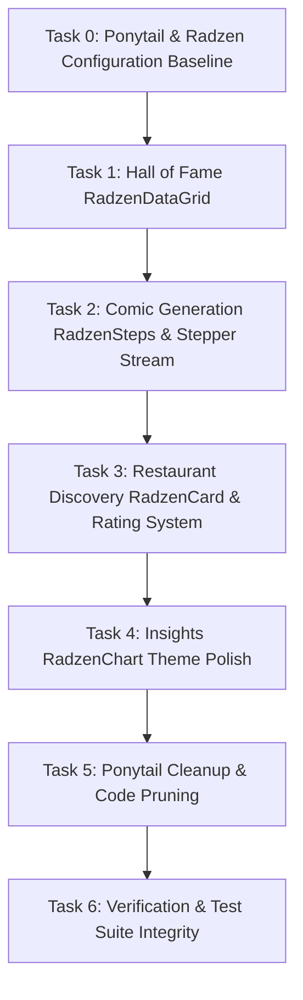

# Implementation Plan — PoSeeReview Modernization & Radzen Integration

## 1. Architecture Decisions (ADRs)

- **ADR-01: Radzen DataGrid for Hall of Fame**
  - *Context:* The current leaderboard uses custom divs and a three.js/canvas shelf background, lacking built-in multi-column sorting, filtering, and paging.
  - *Decision:* Migrate to `RadzenDataGrid<LeaderboardEntryDto>` with custom column templates for ranks/medals, strangeness score badges, and action triggers. Retain subtle background styling without interfering with grid keyboard accessibility.
  - *Consequence:* Out-of-the-box sorting, filtering, pagination, and high accessibility compliance with reduced bespoke CSS.

- **ADR-02: RadzenSteps / RadzenTimeline for Live SSE Comic Generation**
  - *Context:* `LoadingIndicator.razor` currently runs a complex SVG stroke-dasharray simulation with timer fallback.
  - *Decision:* Use `RadzenSteps` / `RadzenTimeline` bound directly to incoming `ComicGenerationEventDto` events from the server-sent events (SSE) endpoint.
  - *Consequence:* Eliminates client-side progress guessing, keeps UI in strict sync with server phases, and reduces custom animation code.

- **ADR-03: RadzenCard, RadzenRating & RadzenBadge on Discovery**
  - *Context:* `RestaurantCard.razor` uses handcrafted CSS classes for star ratings and badges.
  - *Decision:* Adopt `RadzenCard`, `RadzenRating` (read-only for Google rating display), and `RadzenBadge` for proximity and price levels.
  - *Consequence:* Cleaner component templates, unified Radzen token theming, and faster rendering.

- **ADR-04: Ponytail Decision Ladder Enforcement**
  - *Context:* Over time, custom JS and redundant CSS classes crept into the client project.
  - *Decision:* Apply DietrichGebert/ponytail's 7-step decision ladder to each UI modernization task. Before writing any custom logic, evaluate whether `Radzen.Blazor` or the browser platform natively supports it.
  - *Consequence:* Reduced LOC, cleaner code maintenance, zero duplicate style rules.

---

## 2. Dependency Graph

---

## 3. Risks & Mitigations

| Risk | Impact | Likelihood | Mitigation |
|---|---|---|---|
| **Radzen CSS conflicts with design system layers** | Medium | Low | Radzen styles are strictly imported into `@layer vendor` in `app.css`, ensuring custom design tokens in `@layer tokens` and primitives in `@layer shared` override vendor defaults predictably. |
| **Playwright E2E UI selector breakage** | High | Low | Preserve all existing test data attributes (e.g. `data-testid`, `role`, and core class hooks like `.leaderboard-container`) so E2E UI tests continue passing. |
| **SSE stream buffering on WASM** | Medium | Low | Ensure `SetBrowserResponseStreamingEnabled(true)` remains active on `ApiClient` SSE requests so step changes trigger immediate UI rerenders. |
| **Mobile responsiveness regression** | Medium | Low | Configure `Responsive="true"` on `RadzenDataGrid` and test viewports down to 320px width. |

---

## 4. Checkpoints

- **Checkpoint 1 (After Tasks 1 & 2):** Core user loops (Leaderboard & Comic Generation) operational with Radzen controls. Run `dotnet test tests/PoSeeReview.Unit` and verify build cleanliness.
- **Checkpoint 2 (After Tasks 3 & 4):** Discovery and Insights updated. Verify visual layout in browser and ensure 0 regressions in shared DTO mappings.
- **Checkpoint 3 (After Tasks 5 & 6):** Ponytail pruning completed, full test suites executed (`Unit`, `Integration`, `E2EAPI`), and zero warnings confirmed.

